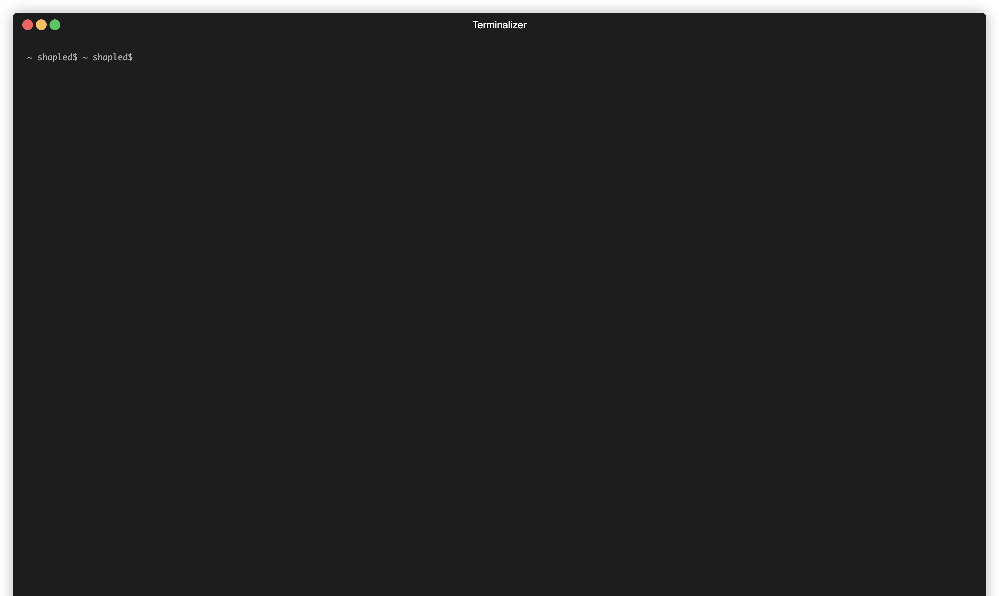

# Seli - Command Line Launcher

English | [简体中文](docs/README_CN.md)

Seli is a TUI-based command line tool launcher that allows you to conveniently manage and execute preset commands.

## ✨ Features

- 🎨 **Beautiful Terminal User Interface** - Modern TUI design
- 📁 **Folder and File Browsing** - Support for hierarchical directory navigation
- 📄 **Multi-format Configuration Files** - Support for JSON, YAML, TOML formats
- 🚀 **Environment Variable Support** - Support for `.env` files and command-level environment variables
- 🔄 **Smart Variable Replacement** - Support for dynamic environment variable replacement in configurations
- 🎯 **Command Display Control** - Control command visibility through the `show` field
- 📂 **Working Directory Configuration** - Each command can set an independent working directory
- ⌨️ **Keyboard Shortcuts** - Intuitive keyboard operations
- 🏠 **Auto-configuration Directory** - Automatically create `~/.seli/` configuration directory
- 🔄 **Cyclic Navigation** - List end-to-end cyclic navigation

## 🎬 Demo



## 🚀 Quick Start

### 1. Installation

```bash
go install github.com/shapled/seli@latest
```

### 2. Create Configuration

```bash
# create config directory
mkdir ~/.seli

# create env file
echo 'TEST_ENV_A=Apple
TEST_ENV_B=Banana' > ~/.seli/.env

# create config file
echo 'name: Fruits Commands
description: Demonstrates setting and using specific environment variables for command execution.

commands:
  - name: "Show Fruit A"
    description: "Sets TEST_ENV_A and prints it."
    command: "echo"
    args: ["Fruit A is: ${TEST_ENV_A}"]

  - name: "Show Fruit B"
    description: "Sets TEST_ENV_B and runs in tmp directory."
    command: "sh"
    args: ["-c", "echo \\${PWD}; echo Fruit B is: ${TEST_ENV_B}"]
    workDir: "/tmp"
    show: true

  - name: "Show Fruit C"
    description: "Sets TEST_ENV_C and shows usage."
    command: "echo"
    args: ["Cherry", "details:", "${TEST_ENV_C}"]
    env:
      TEST_ENV_C: "Cherry - Often used in juice"' > ~/.seli/fruits.yml

# run
seli
```

## Usage

### 1. Run the Program

```bash
seli
```

### 2. Configuration File Structure

Create configuration files in the `~/.seli/` directory, supporting the following formats:

#### JSON Format (`development.json`)

```json
{
  "name": "Development Tools",
  "description": "Common development commands",
  "commands": [
    {
      "name": "Start Dev Server",
      "description": "Start the development server",
      "command": "npm",
      "args": ["run", "dev"],
      "env": {
        "NODE_ENV": "development",
        "PORT": "3000"
      }
    },
    {
      "name": "Git Status",
      "description": "Check git status",
      "command": "git",
      "args": ["status"]
    }
  ]
}
```

#### YAML Format (`system.yaml`)

```yaml
name: System Commands
description: System administration commands
commands:
  - name: "Disk Usage"
    description: "Check disk usage"
    command: "df"
    args: ["-h"]

  - name: "Memory Usage"
    description: "Check memory usage"
    command: "free"
    args: ["-h"]
```

#### TOML Format (`docker.toml`)

```toml
name = "Docker Commands"
description = "Docker container management commands"

[[commands]]
name = "List Containers"
description = "List all running containers"
command = "docker"
args = ["ps"]

[[commands]]
name = "Stop All Containers"
description = "Stop all running containers"
command = "docker"
args = ["stop", "$(docker ps -q)"]
```

### 3. Keyboard Operations

- **↑/↓** or **j/k**: Move up and down to select
- **Enter**: Select file/folder or execute command
- **Backspace**: Return to parent directory (in command list)
- **q**: Return to directory browsing (in command list)
- **Esc/Ctrl+C**: Exit the program

## 📖 Configuration File Field Description

### Command Fields

| Field         | Type              | Required | Description                               |
| ------------- | ----------------- | -------- | ----------------------------------------- |
| `name`        | string            | Yes      | Name of the configuration file or command |
| `description` | string            | No       | Description information                   |
| `command`     | string            | Yes      | Command to execute                        |
| `args`        | []string          | No       | Command arguments                         |
| `env`         | map[string]string | No       | Command-level environment variables       |
| `workDir`     | string            | No       | Working directory                         |
| `show`        | bool              | No       | Whether to display in command list        |

### Environment Variable Priority

Environment variable replacement follows the following priority (from high to low):

1. **Command-level environment variables** (variables defined in the `env` field)
2. **System environment variables** (system-level environment variables)
3. **Variables in `.env` files** (`~/.seli/.env` and `.env` in the configuration directory)

### Variable Replacement Rules

- Support `${VAR_NAME}` format variable replacement
- Support escape characters `\${VAR_NAME}` to avoid variable replacement
- Command-level environment variables can reference variables in `.env` files
- Variable replacement occurs during configuration loading

## Contributing

Welcome to submit Issues and Pull Requests!

## License

MIT License
